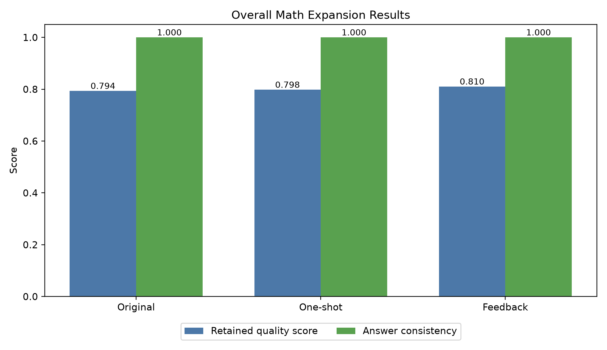
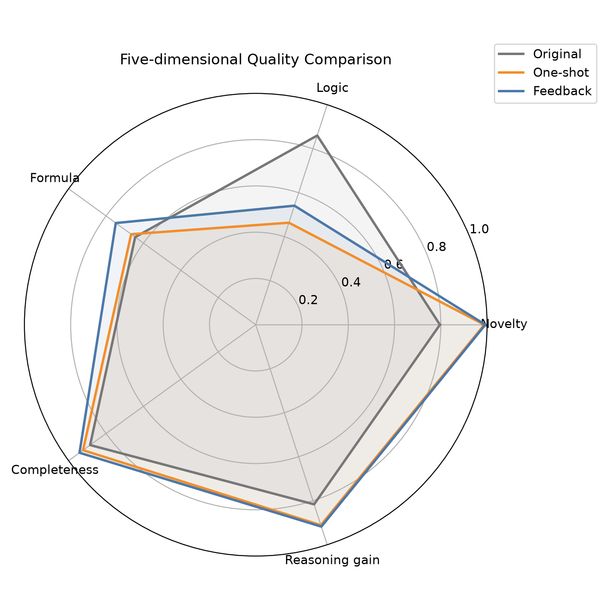
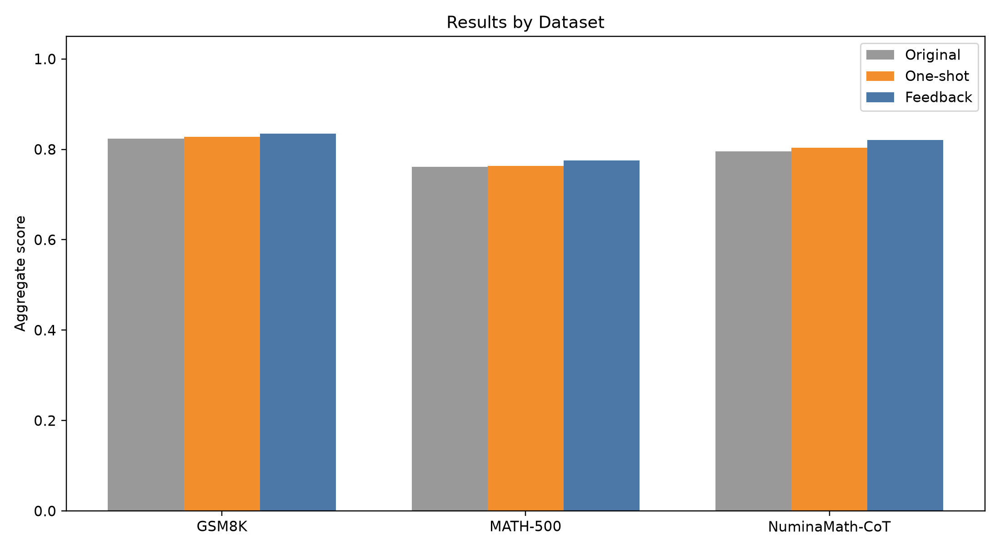
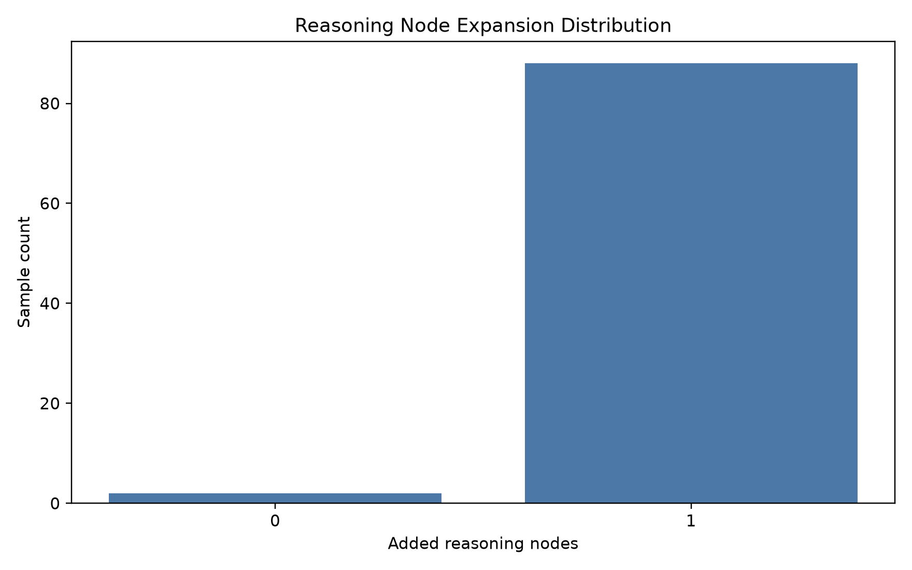

# 数学推理链扩充与质量反馈实验

## 1. 任务定义

数学部分扩充的对象不是题目数量，而是已有解答中的中间推理信息。系统把原始 CoT 切分为多个步骤，
构建顺序 Reasoning Graph，从中选择一个可恢复的中间节点进行遮盖，再让大模型依据题目、前缀和后缀
恢复更细粒度的过渡步骤。该设计参考了 Fill-in-the-Middle 式推理恢复、Reasoning Graph 和错误反馈再生成
的思想，但没有训练 MathFimer 模型，也没有实现强化学习或完整的多智能体框架。

## 2. 方法流程

实验流程如下：

原始题目与正确 CoT
→ 步骤切分与节点分类
→ 优先遮盖公式变换、推断或解释类中间节点
→ LLM 恢复两个更细的中间步骤
→ 五维质量评价
→ 失败时反馈优化，最多三次
→ 通过严格门控后合入 CoT，否则保留原节点。

五维评价包括去重复性、逻辑一致性、公式正确性、完整性和推理增益。旧实现只要质量增益大于 0
就可以保留，容易接受偶然波动。本次将接收规则改为同时满足：

1. 综合质量分不低于 0.80；
2. 相比原节点提升超过 0.01；
3. 最终答案通过数值、集合或 SymPy 等价验证；
4. 一个遮盖节点至少扩充为两个有效步骤。

## 3. 数据集与实验设置

实验使用三个公开数据集，每个数据集随机抽取并完成 30 条，共 90 条：

| 数据集 | 用途 | 原始来源 |
|---|---|---|
| GSM8K | 基础多步应用题 | OpenAI `grade-school-math` 官方仓库 |
| MATH-500 | 代数、几何、数论等较难题目 | Hugging Face `HuggingFaceH4/MATH-500` |
| NuminaMath-CoT | 较长推理链补充 | Hugging Face `AI-MO/NuminaMath-CoT` |

下载候选池为每个数据集 100 条。审计后，GSM8K 有 100 条满足要求；MATH-500 有 68 条能形成至少三个
推理节点；NuminaMath-CoT 有 97 条可自动验证。过短、缺字段或需要人工判断的题不会进入正式随机抽样。

三组对照使用同一道题和同一个遮盖位置：原始 CoT、单次恢复、最多三轮反馈优化。调用模型为
`gpt-5.6-terra`，温度为 0.2，随机种子为 20260927。90 条完整轨迹共保存 250 次 API 回复，
对应 450,886 个 Token。连接失败或停止进程时未形成完整样本的在途请求不计入正式统计。

## 4. 实验结果

| 方法 | 候选综合分 | 门控保留后综合分 | 相对原始提升 | 严格接收率 | 答案一致率 |
|---|---:|---:|---:|---:|---:|
| 原始 CoT | 0.794 | 0.794 | +0.000 | 100.0% | 100.0% |
| 单次恢复 | 0.761 | 0.798 | +0.004 | 6.7% | 100.0% |
| 反馈优化 | 0.804 | 0.810 | +0.017 | 21.1% | 100.0% |

反馈优化最终接收 19 条，单次恢复仅接收 6 条。反馈方法的候选平均分高于原始 CoT，但经过门控后，
未提升的候选仍会被拒绝并回退到原节点，因此最终保留数据的平均分提高到 0.810，且没有破坏最终答案。
反馈方法比单次恢复的门控后综合分高 0.012，说明自然语言反馈能提高获得合格扩充步骤的概率。

分数据集结果如下：

| 数据集 | 原始分 | 单次恢复后 | 反馈优化后 | 反馈接收率 |
|---|---:|---:|---:|---:|
| GSM8K | 0.824 | 0.827 | 0.835 | 23.3% |
| MATH-500 | 0.761 | 0.764 | 0.776 | 10.0% |
| NuminaMath-CoT | 0.795 | 0.803 | 0.821 | 30.0% |

## 5. 结果分析

GSM8K 的步骤结构清楚，遮盖节点通常对应单个算术关系，因此恢复结果较稳定。NuminaMath-CoT 的原始
推理较长，模型可以利用更多上下文，反馈接收率达到 30.0%。MATH-500 中不少原始解答十分紧凑，生成的
展开虽然往往保持答案正确，但较难同时超过 0.80 阈值和原节点质量，因此接收率相对较低，为 10.0%。

这个结果说明，节点扩充并非对所有数学解答都必然有效。对已经非常精炼的高质量节点，继续改写可能只会
增加文字而不增加推理价值。严格门控的作用正是只保留有证据表明质量提升的扩充结果，并拒绝其余候选。

## 6. 局限与后续工作

当前实验规模为 90 条，已经能够支撑结题阶段的对照展示，但仍不能替代更大规模统计结论。五维评价仍包含
启发式指标，综合分不等同于形式化数学证明。后续可扩大到每个数据集 50 至 100 条，并按题型、难度和
节点类型分别统计；对于 MATH-500，可在不降低最终答案约束的前提下，按数据集校准阈值，或加入独立的
LLM Judge 与人工抽检。所有原始轨迹、拒绝原因和数据来源均已保存，便于复核和扩展。
